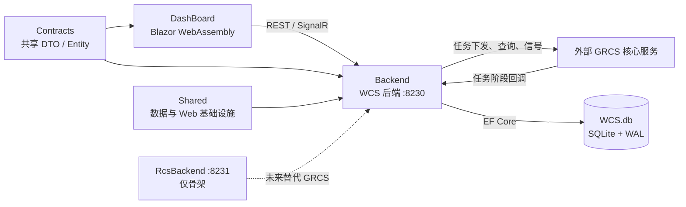

# 项目现状

更新时间：2026-09-10  
范围：当前仓库中的 WCS 前端、WCS 后端、Contracts 契约层和 Shared 公共设施层。RCS 目前只有工程骨架，不属于已交付业务能力。

## 1. 系统定位

本仓库实现的是一个面向仓储调度系统的 WCS 管理与模拟系统。WCS 负责保存配置、选择站点和库存、下发任务、接收任务阶段回调，并将状态提供给浏览器控制台。实际的任务执行、车辆和地图等核心能力由仓库外的 GRCS 服务提供。

系统的职责边界如下：

| 层/系统 | 当前职责 | 不承担的职责 |
| --- | --- | --- |
| DashBoard | 操作界面、状态展示、浏览器侧缓存与连接管理 | 不执行自动化任务和业务模块 |
| WCSBackend | 自动化编排、库存账本、任务下发、回调处理、实时推送 | 不执行车辆调度算法 |
| GRCS | 接收任务、车辆/货物/地图等核心能力 | 不保存 WCS 的配置与控制台状态 |
| Contracts | 前后端共享的请求、响应、实体和枚举定义 | 不含业务实现 |
| Shared | 数据访问、SQLite、HTTP 管线、通用仓储 | 不含 WCS 业务规则 |
| RcsBackend | 为以后替换 GRCS 预留的宿主和模块入口 | 当前没有可用的 RCS 协议实现 |

## 2. 仓库与项目结构

| 目录 | 项目/目标框架 | 已实现内容 |
| --- | --- | --- |
| `Backend/` | `WCSBackend`，.NET 10 | WCS API、自动化、GRCS 代理、SQLite 迁移、SignalR |
| `DashBoard/` | `Dashboard`，.NET 10 Blazor WASM | WCS 模拟器与管理控制台，使用 MudBlazor |
| `Contracts/` | .NET 8 类库 | DTO、实体、模板/自动化/地图/任务等公共模型 |
| `Shared/` | `Backend.Shared`，.NET 10 类库 | `DbContext`、仓储/UoW、WAL、CORS、异常与健康检查 |
| `RcsBackend/` | .NET 10 | 独立 `rcs.db`、端口和共享设施接入；业务模块尚空 |
| `Solutions/Ryan.sln` | 解决方案 | 聚合上述项目 |
| `数据库备份/` | 运维资料 | 数据库备份文件 |

WCS 后端默认监听 `http://0.0.0.0:8230`；RCS 骨架默认监听 8231。WCS 使用 `WCS.db`，RCS 预留独立的 `rcs.db`，两者不会共用数据文件。

## 3. WCS 后端架构

`Backend/Program.cs` 是组装入口，启动顺序为：

1. 注册 JSON、CORS、SignalR。
2. 注册 Shared 的 SQLite、`DbContextFactory`、仓储和工作单元。
3. 注册 WCS 总模块。
4. 安装全局异常处理器。
5. 执行 EF Core 迁移并设置 SQLite WAL 模式。
6. 映射控制器、任务阶段 Hub 和 `/health/ready`。

### 3.1 模块划分

WCS 业务代码集中在 `Backend/Modules/Wcs/`：

| 子目录 | 职责 |
| --- | --- |
| `Automation/` | 自动模板执行、任务下发、库存流转、信号自动放行、移动循环、归巢模式、任务生命周期 |
| `Console/` | 面向控制台的自动化、库存、台账、模板、地图、日志、Mock 和异常记录 API |
| `Proxy/` | 对 GRCS 的 HTTP 调用和转发 API |
| `Infrastructure/` | SQLite 持久化 Store、实体映射、配置、站点锁、运行闸门和日志缓存 |
| `Realtime/` | `/hubs/task-stages` SignalR Hub |
| `Migrations/` | WCS 数据库 EF Core 迁移 |

`WcsModuleExtensions.AddWcsModule()` 统一注册依赖。配置与存储服务大多为单例，因为它们需要跨 HTTP 请求和后台服务共享状态；实际数据库操作则通过 `IDbContextFactory` 创建短生命周期上下文。

### 3.2 Web 管线与运行机制

- 控制器使用 Newtonsoft.Json，时间格式固定为 `yyyy-MM-dd HH:mm:ss.fff`，这是与 GRCS 的协议兼容要求。
- 全局异常会记录日志，并以 `{ "error": "..." }` 返回，便于前端显示友好错误。
- `/health/ready` 会测试 SQLite 可连接性；正常返回 `{ status: "ready", sqlite: "ok" }`。
- CORS 在未设置 `CORS_ORIGIN` 时允许开发环境的来源访问；生产部署应设置为实际前端域名。
- SQLite 使用 WAL 模式和 30 秒连接忙等待，减轻读写并发时的 `database is locked` 问题。

## 4. 数据与契约层

### 4.1 Contracts

`Contracts` 是 Dashboard 与 Backend 的共同引用。其 `Dtos/` 中包含任务模板、任务阶段、Mock 规则、自动化、地图、库存和 GRCS API 文档模型；`Entities/` 中包含 SQLite 持久化实体。

当前 `TaskRecord` 是任务事实流水的核心实体，对应 `task_records`：

| 记录类型 | 来源 | 含义 |
| --- | --- | --- |
| `CREATED` | WCS 确认 GRCS 接收任务后写入 | 任务已被受理的台账创建行 |
| `START` | GRCS 回调 | 任务开始 |
| `LOAD_FINISH` | GRCS 回调 | 载货完成，源库存已经取走 |
| `FINISHED` | GRCS 回调 | 任务完成 |

创建行和阶段行共用自增 `Id`，因此前端能以 `sinceId` 增量拉取。任务模板、功能模块、自动模板、地图、配置、Mock、库存、站点锁等也都由相应 Store 保存在 WCS SQLite 数据库中。

### 4.2 Shared 公共设施

`Shared` 没有 WCS 业务规则，提供以下通用能力：

- `GrcsDbContext`：按业务应用传入的程序集扫描 EF 实体配置。
- `AddSharedModule`：创建以宿主目录为基准的 SQLite 连接，指定迁移程序集，并注册工作单元工厂。
- 泛型 `Repository<T>`、`UnitOfWork` 和 `IUnitOfWorkFactory`：供单例 Store 安全地按需创建数据库操作单元。
- `SqliteWal`：启用 WAL，提高读写并发可用性。
- `WebPipelineExtensions`：JSON、CORS、异常处理和健康检查，可被 WCS/RCS 共用。

## 5. 任务下发与自动化机制

### 5.1 自动模板执行

`AutoTemplateRunner` 是后端常驻服务。前端只负责配置、开始/停止和显示状态；自动任务循环始终在 WCS 后端运行，因此切换页面或关闭某个浏览器标签不会停止已经启动的后端自动化。

自动模板的单步执行过程为：

1. 读取模板步骤、站点范围、库存和上一步上下文。
2. 按模板的起点/终点站点类型筛选候选站点，并读取储位的 `selection_status` 排除不可选站点。
3. `selection_status` 取值为 `available`、`start_unavailable`、`destination_unavailable`、`task_start_locked` 或 `task_end_locked`。储位起点和终点会写入任务锁并刷新该状态；非储位点不做 WCS 单任务锁定，可由 RCS 排队执行。
4. 生成 `Auto_<12 位随机串>` 任务号，并在完成协调器中登记这次资源占用。
5. 下发前运行模板的“起点之前”功能模块。
6. 调用 GRCS `POST /api/v1/task_receive`。
7. 只有 HTTP 成功且响应 JSON 的 `success = true` 时，才认定任务被 GRCS 接收。
8. 写入 `CREATED` 台账，延迟后运行“起点之后”模块，标记相关库存为忙碌，并激活资源登记。
9. 后续由 GRCS 阶段回调驱动库存、锁和终点模块收尾。

`AutomationGate` 在进程内互斥自动模板循环与移动任务循环；它能避免同一 WCS 实例中的多个浏览器标签并行执行同一种自动化，但不是跨进程或跨服务器的分布式锁。

### 5.2 统一模块执行

`ModuleRunService` 是手动下发和自动下发共用的模块执行引擎：

| 时机 | 执行内容 |
| --- | --- |
| 下发前 | 模板 `Start.BeforeModules` |
| GRCS 明确接收并写入 `CREATED` 后 | 模板 `Start.AfterModules` |
| 收到 `FINISHED` 后 | 模板 `End.AfterModules` |

功能模块的执行记录写入 `ModuleExecLogStore`，由控制台增量读取。自动任务收到 `FINISHED` 后，锁和库存收尾不会等待终点模块完成，避免一个模块异常或慢接口阻塞资源释放；但这不等于同一自动模板必然立刻下发下一步：只要该任务模板配置了 `End.AfterModules`，调度器会等待 `FINISHED` 并执行完终点模块后才返回当前步骤。若没有终点模块，则由步骤的 `WaitForFinish` 决定是否等待完成回调。资源提前释放后，其他独立的并行模板仍可继续使用该资源。

### 5.3 任务生命周期状态机

`TaskLifecycleService` 负责校验进程内状态变化；`TaskStageService` 则负责持久化原始阶段流水和向前端广播。两者职责分离：

| 状态 | 进入条件 | 后续作用 |
| --- | --- | --- |
| `Dispatching` | 即将调用 GRCS | 标记本次下发已开始 |
| `Accepted` | GRCS HTTP 成功且 body.success 为真 | 写 `CREATED`，允许后续阶段 |
| `Running` | 首个 `START` 回调 | 记录运行中 |
| `LoadFinished` | 首个合法 `LOAD_FINISH` | 推进源库存状态 |
| `Finished` | 首个合法 `FINISHED` | 释放自动任务资源或调度终点模块 |
| `DispatchFailed` | 明确下发失败 | 撤销本次资源预留 |
| `Unknown` | 网络异常、没有状态码等不确定结果 | 保留“是否已被 GRCS 接收”的不确定性 |
| `Cancelled` | 预留取消/强制结束路径 | 不再接受普通后续状态 |

同一任务相同阶段和时间的回调会被去重。即使收到不同时间但重复或乱序的原始回调，流水仍会保留以便追踪；只有第一次合法的状态转换才会触发库存流转、解锁、完成等待器和终点模块等业务副作用。因此重复回调不会重复释放资源。

当前状态机不自动重试 GRCS 请求。遇到网络异常时会进入 `Unknown`，而不是假设任务失败或再次下发，以免产生重复任务。

### 5.4 完成协调与库存流转

`TaskCompletionCoordinator` 是常驻后台服务，订阅 `TaskStageService` 的 `LOAD_FINISH` 和 `FINISHED` 事件。它使用两个独立的进程内队列：

- 生命周期队列：处理载货完成后的库存推进，以及自动任务完成后的站点锁/库存释放。
- 终点模块队列：处理非自动任务的终点模块。

拆分队列的目的，是保证终点模块失败或耗时不会阻塞锁与库存释放。

自动任务资源的规则为：

| 事件 | 处理 |
| --- | --- |
| 下发前 | 锁定起点和需保护的库位终点，登记 reservation |
| 下发失败、下发前被强制停止 | 取消 reservation，释放本次站点锁 |
| `LOAD_FINISH` | 库存由待取/忙碌推进为运输中 |
| `FINISHED` | 释放站点锁，将货物释放到目标站点，删除 reservation |
| 强制结束 | 释放当前进程登记的全部 reservation |

`WcsInventoryStore` 是自动化选池、占用和释放的唯一账本来源。库存常见流转为 ready → picked/busy → transit → destination ready；下发失败会标记失败并回收相应状态。储位行的 `selection_status` 是选点直接使用的状态列：`start_unavailable` 表示没有可出库的 ready 托盘/货物，`destination_unavailable` 表示不能作为终点入库，`task_start_locked` 表示已被任务选作起点，`task_end_locked` 表示已被选作终点，`available` 表示可作为终点入库。任务锁定后状态改为对应的起点或终点锁定状态；`task_lock_id` 只记录当前锁定任务号，任务下发失败、下发前取消或正常 `FINISHED` 都会清空它并刷新状态。非储位点不写这些字段，RCS 可对同一站点排队多个任务。GRCS 库存查询另由 `GrcsInventoryCacheService` 按需提供，不能替代 WCS 自身的自动化库存账本。

## 6. GRCS 集成、回调与模拟

`GrcsHttpClient` 通过 `IHttpClientFactory` 调用 GRCS，默认请求超时 10 秒，车辆移动接口为 7 秒，连通性探测为 2 秒。已覆盖的调用包括：

- `/api/v1/task_receive`：任务组下发。
- `/api/RawOrder/ChangeFloor`：纯移动任务。
- `/api/Cargo`、车辆和地图接口：库存、车辆和地图查询。
- `/api/v1/container_ready`、`container_remove`、`container_operation_finish`：出站信号。
- 通用原始 JSON 转发接口。

GRCS 在线状态会短暂缓存，供信号自动放行等服务在离线时停止发起真实请求。当前没有自动重试、补偿下发或向 GRCS 反查未知结果的机制。

控制台同时提供 Mock 规则与人工审批机制，用于模拟入站事件和任务阶段。任务下发前会检查是否配置了关联任务看板的任务阶段 Mock 卡；未配置时拒绝下发，避免任务永远等不到阶段回调。

## 7. 前端架构与实时机制

Dashboard 是 Blazor WebAssembly 应用。它通过 `WcsApiClient` 调用后端，不直接承担自动化业务。主要页面覆盖自动化任务、手动下发、任务阶段、信号交互、地图、库存、GRCS API 文档、项目日志和异常记录。

每个浏览器标签中的 Scoped 服务会在页面导航间存活，主要服务如下：

| 服务 | 作用 |
| --- | --- |
| `WcsApiClient` | WCS REST API 客户端和连接设置 |
| `AutomationHub` | 汇总自动化、范围、GRCS 健康、信号确认和日志状态的轮询 |
| `TaskStageHub` | 通过浏览器侧 SignalR 接收任务阶段快照、增量、新增和删除事件；本地维护缓存 |
| `BackendHealthService` | 后端可用性状态 |
| `LocalStoreService` | 浏览器本地配置，如后端地址 |

任务阶段实时 Hub 为 `/hubs/task-stages`。新连接会收到任务记录快照及相关运行状态；之后服务端对 `EventAdded`、`TaskRemoved`、`EventsReset` 等事件广播。前端保留轮询作为其他控制台状态的刷新机制，任务阶段的主要同步通道为 SignalR。

## 8. 当前边界与已知限制

1. 任务状态机、完成协调队列、站点锁和自动化闸门都在 WCS 进程内。任务阶段流水、库存账本和储位的 `selection_status`/任务锁字段可持久化；服务重启不会恢复等待器、队列工作或自动化循环，但未完成任务锁定的储位仍会阻止再次选点。对迁移前遗留或没有预留字段的未完成任务，选点还会把台账中“已接收但未 FINISHED”的储位终点视为占用；非储位终点仍允许 RCS 排队。这些都是派单保护，不会恢复原任务执行。
2. GRCS 下发不自动重试。网络不确定时保留 `Unknown`，需要人工判断或以后增加 GRCS 查询协调。
3. `task_records` 的内存/数据库保留上限为 10,000 条，超过后会删除最早记录；这不是长期审计归档方案。
4. 当前未建立自动化测试项目。本轮也未将测试、Mock 重构或接口库存盘点纳入实施范围。
5. CORS 的开发默认值较宽，正式部署前需要配置 `CORS_ORIGIN`；项目当前也没有完整的身份认证和权限体系。
6. RCS 仅完成可启动宿主、共享设施接入和数据库隔离的准备，协议、调度、控制台和实时业务均未实现。
