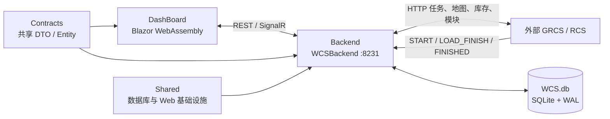

# 项目现状

更新时间：2026-09-18
范围：`DashBoard`、`Backend`、`Contracts`、`Shared` 与 `RcsBackend`。

## 1. 系统边界



| 工程 | 当前职责 |
| --- | --- |
| `DashBoard/` | WCS 管理前端：地图、库存、任务下发、自动化、任务看板、信号交互、异常与项目记录。 |
| `Backend/` | WCS 后端：自动化编排、库存账本、任务生命周期、模块调用、GRCS 代理、SQLite 持久化和实时推送。 |
| `Contracts/` | 前后端共享 DTO、数据库实体、状态常量和模板模型。 |
| `Shared/` | EF Core/SQLite、仓储与工作单元、WAL、CORS、异常处理中间件和健康检查。 |
| `RcsBackend/` | 预留的 RCS 独立宿主，目前只有工程骨架，没有车辆调度和任务业务。 |
| 外部 GRCS/RCS | 接收任务、执行搬运、返回地图和库存、上报任务阶段。 |

WCS 地址由 `Backend/appsettings.json` 的 `Urls` 配置，当前为 `http://0.0.0.0:8231`。运行数据库位于后端内容根目录的 `WCS.db`。

## 2. 当前代码结构

后端 WCS 已按职责重新整理：

```text
Backend/Modules/Wcs/
├─ Automation/
│  ├─ Inventory/       库存选择协调
│  ├─ Modules/         模块调用与执行前/执行后效果
│  ├─ Runners/         移动循环、归巢模式
│  ├─ Tasks/           任务下发、生命周期、完成协调
│  └─ Templates/       自动化模板执行与校验
├─ Console/
│  ├─ Controllers/     Automation / Inventory / Mock / System / Templates
│  └─ Services/        Inventory / Logs / Mock / Tasks
├─ Infrastructure/
│  ├─ Inventory/       WcsInventoryStore
│  ├─ Persistence/     EF 实体配置
│  ├─ Stores/          地图、范围、设置、日志等存储
│  └─ TemplateStores/  自动化、任务和功能模块模板存储
├─ Proxy/              GRCS HTTP 代理
└─ Realtime/           WCS SignalR Hub 与实时发布器
```

前端地图信息页拆为三个职责明确的子组件：

```text
DashBoard/Modules/WcsSimulator/Pages/Map/
├─ MapReader.razor(.cs)    页面容器与共享状态
├─ MapLoad.razor(.cs)      读取地图与站点概览
├─ MapSettings.razor(.cs)  GRCS、场景和 WCS 地址设置
└─ MapCreation.razor(.cs)  可视化创建地图
```

## 3. 持久化数据

WCS 使用 SQLite，启动时自动执行迁移并启用 WAL。主要数据源如下：

| 数据 | 存储 | 说明 |
| --- | --- | --- |
| 任务全周期 | `task_records` | 任务看板唯一任务事实源，最多保留最近 10000 条记录。 |
| 库存与储位 | `wcs_slots` | 一行同时保存储位、托盘、货物、选择状态、任务锁和分拣台关联。 |
| 模块执行详情 | `module_exec_logs` | 保存请求、响应和执行结果，最多保留最近 2000 条，并实时推送前端。 |
| 自动化模板 | `auto_templates` | 自动化步骤链，跨标签页、跨浏览器共享。 |
| 任务模板 | `task_templates` | 手动和自动化下发共用的任务定义。 |
| 功能模块 | `feature_modules` | HTTP 模块、参数来源、执行前效果和执行后库存效果。 |
| 地图、范围、系统设置 | `kv` | `map_stations`、`auto_range`、`wcs_settings`、归巢配置等。 |

`workflow_state` 已退出任务主流程。模块执行日志后来重新采用独立的 `module_exec_logs` 表，以保存适合复制和排查的完整 HTTP 详情；任务看板仍以 `task_records` 为准。

## 4. 任务生命周期

普通自动化任务的主要阶段如下：

```text
CREATED
→ BEFORE_MODULE:<模块ID>
→ DISPATCHED
→ AFTER_START_MODULE:<模块ID>
→ START
→ LOAD_FINISH
→ TRANSIT:托盘号(货物号)
→ FINISHED
→ WCS_FINALIZING
→ WCS_INVENTORY_FINALIZED
→ AFTER_END_MODULE:<模块ID>
→ INVENTORY_EFFECT:<效果>
→ WCS_COMPLETED
```

| 阶段 | 含义 |
| --- | --- |
| `CREATED` | WCS 创建任务并保存任务类型、路线、托盘号和货物号。下发结果会回写该记录。 |
| `BEFORE_MODULE:*` | 下发前模块。任一失败会记录 `CANCELLED`，任务不发给 RCS。 |
| `DISPATCHED` / `DISPATCH_FAILED` / `DISPATCH_UNKNOWN` | RCS 接收成功、明确拒绝或结果未知。结果未知时保留关键锁，避免重复下发。 |
| `START` | RCS 已开始执行。 |
| `LOAD_FINISH` | 已从起点取走库存；WCS 清空起点并生成一条托盘和货物合并的在途记录。 |
| `FINISHED` | RCS 搬运结束，只代表设备侧完成，尚不代表 WCS 库存和模块收尾成功。 |
| `WCS_FINALIZING` | WCS 开始处理终点库存、分拣落位和终点模块。 |
| `WCS_INVENTORY_FINALIZED` | 终点库存已经成功写入。 |
| `WCS_COMPLETED` | WCS 全部收尾成功；自动化下一步和轮次完成均以它为准。 |
| `WCS_FINALIZATION_REASON:*` + `WCS_FINALIZATION_FAILED` | 收尾失败及中文化原因。 |

`TaskLifecycleService` 防止重复或乱序回调重复执行副作用。`TaskCompletionCoordinator` 串行处理 `LOAD_FINISH`、`FINISHED` 和收尾动作；服务启动时还会查找已有 `FINISHED`、但缺少最终结果的任务并重新执行收尾。

## 5. 分拣与回库任务

人工分拣台和实际分拣台通过 `wcs_slots.parent_station_code` 建立关联。分拣任务完成时：

1. WCS 下发人工分拣台；任务完成后，WCS 在该人工分拣台关联的空闲实际分拣台中选择一格写入库存，并写入 `SORTING_SLOT_ASSIGNED:<站点>`。
2. 完成分拣任务自身的库存同步和终点模块。
3. “回库任务预处理”先生成 `<分拣任务号>_R`，保存任务号、托盘、货物、起点、终点并锁定回库储位。
4. 模块 HTTP 成功后写入 `RETURN_TASK_REGISTERED`；明确失败时记录失败并释放可确认的目标锁，结果未知时保留锁。
5. 分拣任务写入 `WCS_WAITING_RETURN`。
6. RCS 回库任务目前没有 `LOAD_FINISH`，因此其 `START` 按“已经从分拣台取货”处理并生成在途记录。
7. 回库任务完成 WCS 收尾后，父分拣任务才写入 `WCS_COMPLETED`；回库失败则父任务写入 `WCS_FINALIZATION_FAILED`。

这使自动化中的后续出库步骤只能在回库库存真正落位后继续。

## 6. 库存与选点

`wcs_slots` 同时管理库存内容和站点选择状态：

| 字段/状态 | 含义 |
| --- | --- |
| `pallet_code` / `cargo_code` | 当前托盘号和货物号。 |
| `pallet_status` / `cargo_status` | `ready`、`picked`、`fail`；在途事实主要来自 `task_records`。 |
| `selection_status=available` | 可作为空终点。 |
| `start_unavailable` | 没有可作为起点的 `ready` 库存。 |
| `destination_unavailable` | 已有库存，不能作为普通终点。 |
| `task_start_locked` / `task_end_locked` | 已被任务锁定为起点或终点。 |
| `task_lock_id` | 占用该储位的任务号。 |
| `parent_station_code` | 实际分拣台所属的人工分拣台。 |

自动化不再使用“启动时固定库存池”。每个选托盘、选货物或选带货托步骤执行前，都会重新读取 WCS 当前库存状态。`TryPick` 在同一个 SQLite 写锁中检查并把完整搬运单元改为 `picked`，所以即使轮次重叠，也不会让两个任务领取同一个托盘或货物。

选点范围由“启用状态 + 非实际分拣台 + 楼层 + Mark 白名单”共同过滤；实际分拣台（`PickingStation`）不能通过范围框选加入，人工分拣台（`PeopleStation`）可以加入。旧的站点类型范围字段仅为兼容保留，保存时强制清零。任务起点来源目前使用“所选库存位置”或“上一步任务终点”，旧模板的历史字段仍做兼容转换。

## 7. 自动化执行

`AutoTemplateRunner` 是后端常驻执行器：

- 可以选择一个或多个自动化模板，并按轮询间隔持续创建新轮次。
- 新轮次无需等待上一轮全部结束，因此轮次可以重叠；原子库存领取和储位任务锁负责避免重复资源。
- 同一模板内按步骤顺序执行。每个选库存步骤使用当时最新的 WCS 库存快照。
- 链路模式会把上一模板的任务终点传给下一模板作为起点。
- 步骤勾选“等待完成”时等待 `WCS_COMPLETED`，分拣任务会连同后续回库一起等待。
- 普通“停止”只停止后续轮询，不撤销已经下发的任务；“强制结束”会终止等待并执行资源清理，但已被 RCS 接收的任务仍需根据现场状态处理。
- GRCS HTTP 调用当前不自动重试。

`AutomationGate` 保证自动化轮询、移动任务循环和批量模式之间互斥。自动化日志按轮次组织；成功轮次完成后自动清理详细日志并保留系统完成提示。

## 8. 实时通信与 HTTP

WCS 统一使用一个 SignalR 端点：`/hubs/wcs-realtime`。它是一条持续连接，有数据变化时推送，不是每秒重新建立连接。

SignalR 当前推送：

- 任务记录快照、增量、删除与重置；
- 自动化运行状态和自动化日志；
- 移动任务统计与归巢模式状态；
- 模块执行日志；
- Mock 请求事件和信号确认状态；
- 地图、选点范围、系统设置、任务模板和功能模块的配置变更通知。

新标签页连接时会收到当前快照。配置变更通知只表示“数据已变化”，页面收到后再用 HTTP 获取权威数据。

HTTP 继续负责：

- 启动、停止、保存、删除、任务下发等命令；
- 地图、库存、模板和配置的首次加载及手动刷新；
- WCS 与 GRCS 健康检查，前端当前约每 5 秒检查一次；
- RCS/GRCS 代理调用。

WCS 后端地址保存在浏览器 `localStorage`，同源多标签页通过 `storage` 事件同步；地址变化后 SignalR 会断开并连接新地址。

## 9. 前端现状

### 地图信息

- 可从 GRCS 接口读取 zip 地图，也可读取本地 `map.json`。
- 解析后的精简站点数据保存到后端 `map_stations`，并同步创建/更新 `wcs_slots` 站点。
- 地图读取、系统设置、地图创建已拆为独立 Razor 子组件及对应 `.razor.cs`。
- 可视化创建地图使用 Canvas 主画布和 HTML/SVG 编辑覆盖层，支持无限平移/缩放、单点、点阵、框选、多选属性、X/Y 对齐，以及储位、接驳位、人工分拣台和分拣台图标。
- “保存到库存地图”按钮目前仍是占位操作，创建数据只在页面内存中。

### 库存管理

- Canvas 地图展示 WCS `wcs_slots` 的空储位、纯托盘、纯货物、带货托、任务锁和在途位置。
- 支持右键人工分拣台并关联实际分拣台。
- 纯货物可以指定储位录入；托盘由 RCS `/AutoContainerEnter` 批量生成后同步回 WCS。
- “RCS 同步至 WCS”会以 RCS 当前库存清空重建账本；存在在途任务时拒绝执行。
- 在途位置在打开或手动刷新库存地图时读取一次，目前没有库存 SignalR 实时推送。
- 增加/删除托盘和货物按钮仍未接入实际写入。

## 10. 当前限制

1. 可视化地图编辑器尚未保存到 `map_stations` 或 `wcs_slots`。
2. 库存地图依赖首次加载和手动刷新，不会随每次库存变化自动推送。
3. 自动化运行状态、正在执行的轮次和等待器仍是进程内状态；服务重启不会自动恢复轮询。已落库的回调和部分任务收尾可以恢复，但不是完整的自动续跑。
4. HTTP 下发结果未知时缺少按任务号向 RCS 反查的闭环，需要人工确认。
5. 当前没有自动化测试工程，也没有完整的登录、权限、操作审计和生产告警。
6. RCS 业务工程尚未实现，WCS 仍依赖外部 GRCS/RCS 协议。
7. 部分早期源码注释存在编码乱码，不影响运行，但应逐步修正。
