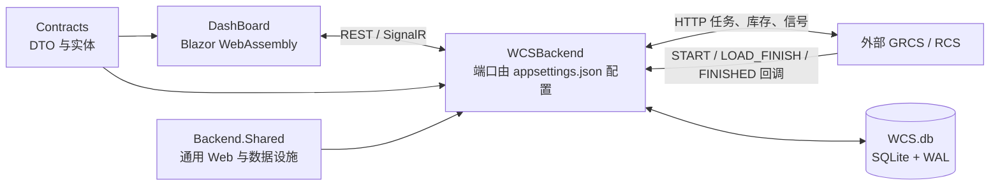

# 项目现状

更新时间：2026-09-13
范围：当前仓库中的 WCS 前端、WCS 后端、Contracts 契约层、Shared 公共设施层。RCS 目前仅保留工程骨架，尚未实现调度业务。

## 1. 系统职责与边界



| 部分 | 当前职责 | 不承担的职责 |
| --- | --- | --- |
| `DashBoard/` | WCS 控制台、自动化配置、任务阶段、库存、信号交互和实时状态展示 | 不执行业务规则，也不直接访问 GRCS |
| `Backend/` | WCS 自动化编排、储位和库存账本、任务下发、阶段回调、模块调用、实时推送 | 不做车辆路径与调度算法 |
| 外部 GRCS | 接收任务、执行搬运、上报任务阶段、提供地图和库存接口 | 不保存 WCS 的自动化配置和台账 |
| `Contracts/` | 前后端共享 DTO、实体、枚举和配置模型 | 不包含业务实现 |
| `Shared/` | SQLite、EF Core、仓储、工作单元、WAL、CORS、异常处理、健康检查 | 不包含 WCS 业务规则 |
| `RcsBackend/` | 预留的独立宿主和数据库边界 | 任务协议、调度、控制台和实时业务尚未实现 |

当前 WCS 监听地址由 [Backend/appsettings.json](Backend/appsettings.json) 的 `Urls` 配置；当前值为 `http://0.0.0.0:8231`。运行数据库是后端运行目录使用的 `WCS.db`，不是 `bin` 目录中的复制文件。

## 2. 代码结构

| 路径 | 内容 |
| --- | --- |
| `Backend/Program.cs` | 应用入口：注册 Web 管线、Shared、WCS 模块、EF 迁移和 SQLite WAL |
| `Backend/Modules/Wcs/Automation/` | 自动化模板轮询、选点、下发、任务完成协调、模块执行和信号自动处理 |
| `Backend/Modules/Wcs/Console/` | 控制台 API、任务阶段服务、配置、模板、库存、地图和日志存储 |
| `Backend/Modules/Wcs/Infrastructure/` | `WcsSlotRow` 储位账本、SQLite Store、实体映射和运行期设施 |
| `Backend/Modules/Wcs/Proxy/` | GRCS HTTP 调用与转发接口 |
| `Backend/Modules/Wcs/Realtime/` | `/hubs/task-stages` SignalR Hub |
| `Backend/Migrations/` | WCS SQLite 迁移；启动时自动执行 |
| `DashBoard/Modules/WcsSimulator/` | WCS 管理页面和浏览器侧状态服务 |
| `Contracts/` | 前后端共享的数据契约和数据库实体 |
| `Shared/` | 通用数据库、HTTP 与 Web 管线实现 |

`WcsModuleExtensions.AddWcsModule()` 统一注册 WCS 服务。大多数 Store 是单例服务；每次数据库操作均通过 `IDbContextFactory` 创建短生命周期的上下文。SQLite 启用 WAL 和忙等待，WCS 对储位写操作还使用进程内写锁，避免同一实例并发选中同一储位。

## 3. 任务记录与任务阶段

`task_records` 是任务全周期的唯一持久化流水表。20260911113000 迁移已删除 `workflow_state` 和 `module_exec_logs` 两张旧表；信号状态和模块执行结果均由 `task_records` 派生。每条阶段记录都保存 `start_station_code`、`end_station_code`、托盘号和货物号，因此不再依赖旧的路线 JSON 或当前站点字段。`stage_status` 取代含义模糊的 `ok` 列，用 `success`、`fail`、`callback` 明确表示本条记录的结果来源。

一条任务会依次产生以下记录，其中带模块 ID 的阶段会记录模块实际执行结果：

```text
CREATED
→ BEFORE_MODULE:<模块ID>
→ DISPATCHED
→ AFTER_START_MODULE:<模块ID>
→ START
→ LOAD_FINISH
→ TRANSIT:托盘号(货号)
→ FINISHED
→ AFTER_END_MODULE:<模块ID>
→ INVENTORY_EFFECT:<cargo_arrival | cargo_removal>
```

| 阶段 | 来源与含义 |
| --- | --- |
| `CREATED` | WCS 生成任务后立即写入；下发结果会回写其 `stage_status`。 |
| `BEFORE_MODULE:*` | 起点之前模块的执行结果，状态为 `success` 或 `fail`。任一此类模块失败时，任务记录 `CANCELLED`，不会下发给 GRCS。 |
| `DISPATCHED` | GRCS 的任务接收接口返回成功，表示 WCS 已成功下发且 GRCS 已接受；同时更新 `CREATED` 行的下发结果。 |
| `AFTER_START_MODULE:*` | GRCS 接收成功后执行的起点之后模块。模块失败会记录，但不撤销已经下发的任务。 |
| `START` | GRCS 回调，`stage_status=callback`，表示设备已开始执行，尚未确认从起点取货。 |
| `LOAD_FINISH` | GRCS 回调，`stage_status=callback`，表示已从起点取走托盘/货物。 |
| `TRANSIT:托盘号(货号)` | WCS 在处理 `LOAD_FINISH` 时写入的一条在途记录。`ContainerCode` 写托盘号，`CargoCode` 写货号；托盘和货物作为一个搬运整体只写一条。 |
| `FINISHED` | GRCS 回调，`stage_status=callback`，表示任务到达终点。自动任务据此释放站点锁并将库存写入终点。 |
| `AFTER_END_MODULE:*` | 终点之后模块的执行结果。 |
| `INVENTORY_EFFECT:*` | 已成功执行的模块触发库存副作用后的记录，状态为 `success` 或 `fail`。 |
| `CANCELLED` / `DISPATCH_FAILED` | 下发前模块失败、明确下发失败或取消时写入。 |

`TaskLifecycleService` 在内存中校验阶段转换，防止重复或乱序回调重复执行库存和锁的副作用。原始回调记录仍保存在 `task_records` 中，便于追溯。服务重启后，运行期队列和等待器不会恢复；已落库的任务阶段、库存和储位锁仍会保留。

## 4. 模块执行机制

`ModuleRunService` 是手动下发与自动化下发共用的执行器。模块请求以 HTTP POST 发给配置的 GRCS 基地址加模块 API 路径，并将结果写入相应的 `task_records` 阶段。

| 时机 | 行为 |
| --- | --- |
| 起点之前 | 先写 `CREATED`，执行 `Start.BeforeModules`；失败即取消，任务不下发。 |
| 下发成功后 | 写 `DISPATCHED`，等待 2 秒后执行 `Start.AfterModules`。 |
| 任务完成后 | 自动化步骤如果配置了终点模块，会等待 `FINISHED` 再执行；普通手动任务由后台终点模块队列执行。 |

模块不自动重试。终点模块与库存/锁收尾使用不同处理路径，因此终点模块的慢调用或异常不会阻塞自动任务的库存落位和资源释放。

模块可配置 `inventory_effect`：`cargo_arrival` 或 `cargo_removal`。只有模块 HTTP 调用成功后才执行对应副作用，且只写入或移除**当前任务的货物**，不改变托盘。起点前、起点后模块作用于任务起点；终点后模块作用于任务终点。副作用结果会作为 `INVENTORY_EFFECT:*` 写入 `task_records`，便于从任务看板追溯模块请求与库存变更的先后关系。

## 5. 储位、库存与在途机制

### 5.1 `wcs_slots`：WCS 自己的库存账本

每个储位或接驳位对应一条 `WcsSlotRow`：

| 字段 | 含义 |
| --- | --- |
| `mark` / `site_type` | 站点编码；类型为 `Storage` 或 `Terminal`。 |
| `pallet_code` / `cargo_code` | 该站点上的托盘号和货号。 |
| `pallet_status` / `cargo_status` | 各自的库存状态。 |
| `selection_status` | 任务选点时直接使用的储位状态。 |
| `task_lock_id` | 当前锁定该储位的任务号。 |

托盘和货物的状态有：

| 状态 | 含义 |
| --- | --- |
| 空字符串 | 该位置没有对应托盘或货物。 |
| `ready` | 在储位中，可作为普通任务起点。 |
| `picked` | 已被任务选择，但尚未收到 `LOAD_FINISH`，仍在起点储位。 |
| `fail` | 下发失败或异常后保留的待确认状态。 |
| `transit` | 旧兼容状态；当前在途展示以 `task_records` 的 `TRANSIT:*` 记录为准。 |
| `grcs_lock` | 从外部 GRCS 同步时可能带入的锁定状态。 |

### 5.2 储位选点状态

`selection_status` 只描述储位能否被自动任务选择：

| 值 | 含义 |
| --- | --- |
| `available` | 空储位，可作为终点。 |
| `start_unavailable` | 无可出库的 `ready` 托盘/货物，因此不能作为起点；空储位通常属于此状态。 |
| `destination_unavailable` | 储位已有托盘或货物，不能作为终点。带 `ready` 库存的储位通常属于此状态。 |
| `task_start_locked` | 已被某任务选作起点。 |
| `task_end_locked` | 已被某任务选作终点。 |

选中储位后会写入 `task_lock_id` 和对应锁定状态。普通任务不会选择已锁定储位。非储位接驳点不使用单任务储位锁，可由 RCS/GRCS 进行排队。

### 5.3 搬运过程

1. 自动化从 `wcs_slots` 的 `ready` 库存选取托盘或货物，并锁定起点/终点储位。
2. GRCS 接收成功后，选中的库存从 `ready` 变为 `picked`。
3. 收到 `LOAD_FINISH` 后，WCS 清空起点储位的托盘/货物、释放起点锁，并写一条 `TRANSIT:托盘号(货号)` 记录。
4. 库存页面通过该在途记录显示一行托盘和货物，不再将同一搬运显示成两条在途数据。
5. 收到 `FINISHED` 后，自动任务将托盘和货物写入终点储位并刷新为 `ready`；若终点是接驳位/出库点，则按站点类型保留或移除库存。

手工“同步”操作以 GRCS 库存为准，重建 WCS 储位账本。它不等同于恢复运行中的自动任务队列。

### 5.4 库存地图与手工库存录入

库存管理页面提供常驻 Canvas 地图：储位、纯托盘、纯货物、带货托、在途和任务锁定使用不同图形与颜色，图标会随地图缩放。地图仅在悬停元素时显示库存详情；选中状态只显示高亮，右侧保留全部已选储位编号，并在该编号框内滚动查看。

右侧操作区与地图画布等高，包含库存类型、编码前缀、RCS 货物模型、选中储位、预留的增删库存按钮，以及 **RCS 同步至 WCS**。同步操作从 GRCS 查询当前库存并重建 `wcs_slots`；存在在途自动化任务时后端拒绝执行，避免覆盖搬运中的账本。

当前手工录入的边界如下：

| 类型 | 当前处理方式 | RCS 约束 |
| --- | --- | --- |
| 纯货物 | 用户框选空储位，WCS 先按前缀和服务器时间生成编码并写入账本，再逐储位调用 RCS `/api/Cargo/Enter`。提交前从 RCS `/api/CargoSize` 读取并校验货物模型。 | 可指定目标储位。 |
| 纯托盘 | 调用 RCS `/AutoContainerEnter`，固定 `type=2`、`num=-1`，随后执行 RCS 同步至 WCS。 | RCS 只支持按楼层批量填充空闲 RACK，不能指定框选储位。 |
| 带货托 | 地图可以展示和悬停查看。 | 手工录入不创建或覆盖带货托。 |

在途托盘位置不建立实时心跳：每次进入或刷新库存地图时，WCS 从 GRCS 获取一次位置快照，用于当前地图展示。

## 6. 自动化与实时前端

`AutoTemplateRunner` 在 WCS 后端运行，浏览器关闭或页面切换不会停止已经启动的自动化轮询。自动化模板由线性步骤组成，可以选托盘、选货物、选带货托，或运行任务模板。步骤可选择是否等待前一任务 `FINISHED`；配置了终点模块的步骤会等待任务完成后再运行模块。

`TaskCompletionCoordinator` 是后台服务，监听 `LOAD_FINISH` 和 `FINISHED`：

- 在 `LOAD_FINISH` 时推进库存并生成在途记录。
- 在自动任务 `FINISHED` 时释放预留、写入终点库存并清理锁。
- 为手动任务异步执行终点模块。

前端通过 `/hubs/task-stages` 接收任务记录快照、增量事件和重置事件。`TaskStageHub` 在浏览器内维护缓存；库存、自动化配置、GRCS 健康和部分控制台状态仍通过 REST 轮询刷新。

## 7. 当前限制

1. 自动化运行队列、任务生命周期状态机和站点预留都在进程内；重启后不会自动续跑或恢复等待关系。
2. GRCS 调用不自动重试。网络超时会留下不确定结果，需要人工确认或后续增加按任务号反查 GRCS 的能力。
3. `task_records` 会保留任务全周期记录，但不是长期审计归档方案；应根据实际运行量建立备份和归档策略。
4. 自动化模板轮询目前没有完整的并发回合控制改造；若轮询周期短于单轮任务耗时，需要评估是否会发生重叠轮次。
5. 当前没有自动化测试工程，也没有完整的认证、授权和生产级运维告警体系。
6. RCS 业务尚未实现，当前 WCS 仍依赖外部 GRCS 协议。
7. 库存地图的“增加/删除托盘、增加/删除货物”按钮目前仅用于展示可操作规则，尚未接入实际写库或 RCS 调用。
