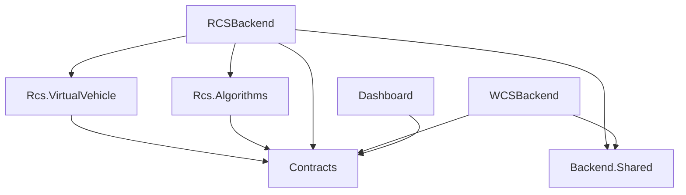

# 项目现状

更新时间：2026-10-03<br>
工作目录：`F:\A_Code\Running_code`<br>
主解决方案：`Solutions/Ryan.sln`

本文依据当前源码和配置描述已存在的实现及其边界，不把规划中的目录或功能当作已完成。后续事项见 [项目待做.md](项目待做.md)。配置值是仓库现状，不代表现场运行值；本文不记录账号密码，也不代表所有链路已经通过联调验收。

## 1. 系统组成

当前解决方案包含 7 个项目：3 个可启动应用和 4 个类库。

| 项目 | 类型与框架 | 当前职责 |
| --- | --- | --- |
| `WCS/WCSBackend` | ASP.NET Core Web，.NET 10 | WCS 模拟器后端：任务下发、自动化、库存账本、Mock 信号、模块执行、记录查询和实时推送。 |
| `RCS/Backend` | ASP.NET Core Web，.NET 10 | 自研 RCS 模拟器后端：数据库地图、地图缓存、任务接收与排队、路径计算和多台虚拟车调度。 |
| `Frontend/Dashboard` | Blazor WebAssembly，.NET 10 | WCS、RCS 共用前端应用，模块页面分别管理。 |
| `Shared/Contracts` | 类库，.NET 8 | 共享请求、响应、模板、状态及地图契约；部分 WCS 类型仍同时承担数据库实体职责。 |
| `Shared/Backend.Shared` | 类库，.NET 10 | MySQL/EF、仓储与工作单元、分类文件日志、HTTP 日志、JSON、CORS、异常处理和健康检查。 |
| `RCS/Algorithms` | 类库，.NET 10 | A* 路径规划；不访问数据库，不依赖后端宿主。 |
| `RCS/VirtualVehicle` | 类库，.NET 10 | 虚拟车的路径执行、暂停、继续、取消、重置和状态事件；由 RCS 后端进程调用，尚非独立程序。 |

外部 GRCS 是另外一套系统。WCS 当前通过其 HTTP 协议读取地图、车辆、库存并下发任务。自研 RCS 已有地图和多虚拟车任务层，但尚未实现完整 GRCS 兼容任务、库存和回调协议，不能仅修改地址就替代外部 GRCS。

### 1.1 项目引用


```mermaid
flowchart TD
    Dashboard --> Contracts
    WCSBackend --> Contracts
    WCSBackend --> BackendShared[Backend.Shared]
    RCSBackend --> Contracts
    RCSBackend --> BackendShared
    RCSBackend --> Algorithms[Rcs.Algorithms]
    RCSBackend --> Vehicle[Rcs.VirtualVehicle]
    Algorithms --> Contracts
    Vehicle --> Contracts
```

WCS 后端与 RCS 后端没有直接项目引用，项目引用没有形成循环。共用一个 Contracts 程序集不表示每个应用会使用其中所有类型。

### 1.2 地址与配置

| 项目/连接 | 当前来源与配置 | 含义 |
| --- | --- | --- |
| WCS 监听 | `WCS/WCSBackend/appsettings.json`：`http://0.0.0.0:8231` | WCS HTTP 和 SignalR 服务地址。 |
| 自研 RCS 监听 | `RCS/Backend/appsettings.json`：`http://0.0.0.0:8232` | 自研 RCS HTTP 和 SignalR 服务地址。 |
| Dashboard HTTP 开发地址 | `Properties/launchSettings.json` 的 http profile：`http://localhost:5180` | 浏览器前端开发服务；其他 profile 地址不同。 |
| 浏览器连接 WCS | localStorage：`grcs_wcs_url` | API 和 WCS SignalR 访问目标；部分默认值/占位仍是 8230，与后端当前 8231 不一致。 |
| WCS 对接外部 GRCS | 后端 `wcs_settings` 配置及浏览器运行时缓存 | GRCS 访问目标、场景；不同机器的实际保存值可能不同。 |
| 浏览器连接自研 RCS | localStorage：`rcs_backend_url`，默认 `http://localhost:8232` | 自研 RCS API 和实时连接目标。 |

`appsettings.json` 是应用配置；`launchSettings.json` 是 VS / dotnet run 的开发启动 profile。监听还可能受所选 profile、环境变量和命令行覆盖。

前端设置修改访问目标，不会修改后端监听端口或数据库连接。WCS 访问地址保存在浏览器；GRCS 地址和场景还通过 HTTP 保存到 WCS 数据库。RCS 前端地址目前只保存在浏览器，没有 RCS 系统配置表。

## 2. 实际目录与层级

```text
Running_code/
├─ Solutions/Ryan.sln
├─ WCS/WCSBackend/
│  ├─ Program.cs、appsettings.json、Properties/、Migrations/
│  └─ Modules/Wcs/
│     ├─ Api/
│     │  ├─ Controllers/        Automation、Inventory、Logs、Mock、System、Templates
│     │  └─ Services/           Inventory、Logs、Mock、Tasks
│     ├─ Automation/            Inventory、Modules、Runners、Tasks、Templates
│     ├─ Infrastructure/
│     │  ├─ Inventory/
│     │  ├─ Persistence/        Entities、Configurations
│     │  ├─ Stores/、TemplateStores/
│     │  └─ Integrations/Grcs/  Controllers、Services
│     └─ Realtime/
├─ RCS/
│  ├─ Backend/
│  │  ├─ Program.cs、appsettings.json、Properties/、Migrations/
│  │  └─ Modules/Rcs/
│  │     ├─ Api/
│  │     ├─ Application/      Tasks、Scheduling、Execution、Simulation
│  │     ├─ Infrastructure/    Entities、Configurations、Stores
│  │     └─ Realtime/
│  ├─ Algorithms/AStar/
│  └─ VirtualVehicle/
├─ Shared/
│  ├─ Contracts/
│  │  ├─ Wcs/                 Tasks、Inventory、Automation、Realtime、System
│  │  └─ Rcs/                 Map、Route、Vehicle、Tasks
│  └─ Backend.Shared/         Repository、Logging、数据库与 Web 公共设施
├─ Frontend/Dashboard/
│  ├─ Layout/、Pages/、wwwroot/
│  └─ Modules/
│     ├─ WcsSimulator/        Pages、Services、Models、Components、Extensions
│     └─ RcsSimulator/        Pages、Services、Components
├─ 数据库备份/
├─ dotnet-tools.json
├─ 项目现状.md
└─ 项目待做.md
```

WCS 物理目录已使用 Api、Infrastructure/Integrations，但不少命名空间仍使用旧的 Console、Proxy。RCS 的 Api 和 Application 命名空间已与目录统一。部分搬到 WCS 后端的实体仍声明为 Contracts.Entities，WCS 命名空间统一尚未完成。

迁移分别保存在各后端 Migrations 目录，没有独立的 MySQL 迁移项目。本地 dotnet-tools.json 固定 dotnet-ef 为 9.0.16；EF Core Design 为 9.0.16，Pomelo provider 为 9.0.0。

## 3. 数据库和公共设施

目前只支持 MySQL。WCS 的连接键是 `ConnectionStrings:WcsDatabase`，仓库数据库名是 wcs_db；RCS 的连接键是 `ConnectionStrings:RcsDatabase`，仓库数据库名是 rcs_db。连接配置位于各自后端 appsettings.json。

公共 GrcsDbContext 分别扫描各后端传入的实体配置程序集；业务通过 Set<T>() / 仓储访问。Store 每次操作创建短生命周期工作单元，避免长期持有 DbContext。

启动时执行自身迁移，没有迁移时公共代码回退 EnsureCreatedAsync。CommitAsync 当前只调用 SaveChangesAsync；DeleteWhereAsync 使用立即执行的 ExecuteDeleteAsync，没有公共显式事务接口覆盖多步删除和写入。

### 3.1 WCS 表与保留规则

| 表 | 内容 | 当前保留策略 |
| --- | --- | --- |
| task_records | 任务创建、回调、下发结果、库存和模块收尾阶段；一个任务通常有多行。 | 最近 50,000 行，按 ID 裁剪。 |
| mock_request_events | 请求信号、审批决策和处理状态。 | 最近 50,000 行，不按是否审批区分。 |
| module_exec_logs | 模块执行阶段、HTTP 状态、请求响应详情和结果。 | 最近 50,000 行；查询接口默认取最近 200 行。 |
| wcs_slots | 站点坐标、托盘、货物、库存状态、任务锁、分拣台关联。 | 没有统一条数上限。 |
| task_templates、auto_templates、feature_modules | 任务模板、自动化模板、功能模块。 | 没有统一条数上限。 |
| mock_rules | 通用 Mock 入站规则。 | 没有统一条数上限。 |
| kv | 地图站点、范围、系统设置、归巢配置等。 | 没有统一条数上限。 |
| exception_records、project_logs | 异常记录和项目记录。 | 没有统一条数上限。 |

50,000 是每张指定表的记录行数，不是任务数，也不是所有表的统一限制。数据库记录与文件日志是不同存储途径。

### 3.2 RCS 地图表

| 表 | 内容 |
| --- | --- |
| rcs_maps | 地图编码、名称、场景、来源、版本、发布状态、当前标记、坐标系、原点和时间。 |
| rcs_map_points | 所属地图、点编码、名称、类型、楼层、XYZ、启用状态及扩展信息。 |
| rcs_map_lines | 所属地图、线编码、起终点、方向、距离、最高速度和启用状态。 |

三表通过 MapCode 和点编码建立应用层关系，没有数据库外键，也未配置业务二级索引；各表有主键。

另有任务层迁移 `AddRcsTaskLayer`，定义 `rcs_tasks`：任务报文、优先级、状态、车辆、地图及版本、执行路径和起止时间。任务表有 TaskId 唯一索引和状态/优先级/Id 排队索引，不使用外键。后端启动沿用现有自动迁移入口；本轮按用户要求不验证数据库实际建表和读写。尚无 RCS 库存或系统配置业务表。

## 4. WCS 任务、自动化与库存

| 组件 | 当前职责 |
| --- | --- |
| AutoTemplateRunner | 周期创建轮次、执行步骤模板、等待完成、记录轮次日志。 |
| TaskDispatcher、ModuleRunService | 任务准备和下发、模块调用与结果记录。 |
| TaskStageService | 阶段持久化、查询、完成等待和任务实时事件。 |
| TaskLifecycleService | 进程内阶段状态机，过滤重复和不允许的转换。 |
| TaskCompletionCoordinator | 队列组织库存收尾、锁释放、终点模块、父子任务完成。 |
| WcsInventoryStore | 库存读写、选池、领取、任务锁、分拣落位和同步重建。 |
| MoveLoopRunner、NestRunner | 纯移动循环与指定车辆归巢任务。 |
| AutomationGate | 自动化、移动循环和相关批量模式的进程内互斥。 |

典型链路如下；具体模板可能跳过模块或额外创建回库任务：

```text
CREATED → 下发前模块 → DISPATCHED → 起点后模块
→ START → LOAD_FINISH → FINISHED
→ WCS_FINALIZING → WCS_INVENTORY_FINALIZED
→ 终点后模块 / 库存效果 → WCS_COMPLETED
```

FINISHED 表示 RCS 设备侧结束。步骤配置“等待完成”时等待 WCS_COMPLETED；收尾失败记录 WCS_FINALIZATION_FAILED 和原因。执行器在步骤成功完成时输出步骤完成日志。

自动化允许轮次重叠，同一轮次按步骤顺序执行；每次选库存读取当前 WCS 账本。领取和站点锁写入使用单进程串行保护，不能视为支持多个 WCS 后端实例共同竞争库存。

普通停止不撤销已被 RCS 接收的任务；强制结束涉及等待与预留清理，已接收任务仍需现场确认。启动时扫描已 FINISHED、缺少最终结果的任务补做部分收尾；自动化轮次、运行循环和等待器没有完整持久化恢复。

### 4.1 分拣、回库与库存操作

- 人工分拣台与实际分拣台通过 wcs_slots.parent_station_code 关联。
- 分拣完成后由 WCS 在关联空闲实际分拣台中自行选择库存落位，不以 RCS 回调站点决定实际分拣台库存。
- 回库预处理可登记“父任务号_R”并预留目标储位；父任务可进入 WCS_WAITING_RETURN，待回库完成后才完成。
- 结果未知与明确失败分开处理；没有统一的 RCS 反查和人工恢复闭环。
- “RCS 同步至 WCS”读取外部库存后清空重建 WCS 账本；检测到在途任务时拒绝。该操作不删除表或重建表结构。
- “生成 RCS 托盘”调用外部 /AutoContainerEnter，成功后不自动同步或写入 WCS 库存。
- 纯货物手工入库和人工分拣台关联已接入；部分库存增删按钮仍是占位。
- 库存地图主要依赖首次加载和手动刷新，没有完整库存变化 SignalR 推送链路。

### 4.2 时间协议

任务下发的 MsgTime / CreateTime 使用本地时间字符串 `yyyy-MM-dd HH:mm:ss`，精确到秒；GRCS 客户端下发前还会规范化。任务协议不携带时区偏移，需要两端时区和系统时钟一致。

普通响应、数据库和日志并非全部采用这一格式。公共 Newtonsoft JSON 配置仍为 `yyyy-MM-dd HH:mm:ss.fff`，文件日志事件保存带偏移时间并输出本地时间。

## 5. WCS 前端与 Mock

WCS 前端包含地图信息、库存管理、手动任务下发、自动化任务、信号交互、任务看板、GRCS 接口说明、异常记录、项目记录、系统设置。

- 地图信息支持外部 GRCS 和本地地图读取，精简站点上传后端并同步库存站点。
- 创建地图支持 Canvas 画布、平移缩放、点位、点阵、框选和坐标对齐；“保存到库存地图”仍是占位，仅保存页面内存。
- 系统设置已经成为独立页面，位于项目记录之后；运行时配置协调器处理浏览器缓存与连接刷新。
- WCS 访问地址保存在浏览器；GRCS 地址与场景通过 HTTP 写入后端设置。浏览器保存和后端保存是分步操作。
- 选点范围排除实际分拣台，允许人工分拣台。/api/wcs/auto/range 用于首次读取、保存和变化后获取，没有每秒浏览器轮询。
- 请求信号记录可双击打开配置；模块执行记录显示各条记录 ID。
- 模板执行、移动循环、归巢实际运行在后端，页面主要提交命令与展示状态。

具体入口之外的 /api/* 可由通用 Mock 控制器接管，按方法、路径、参数匹配规则，返回配置的响应。任务阶段识别与记录也在此链路处理。

未命中 Mock 规则时，当前返回 **HTTP 200**，正文包含 success=false、configured=false 和“请在信号交互 → 通用 Mock 入站中配置”的提示。HTTP 200 不代表业务处理成功，这是当前源码行为。

## 6. 自研 RCS 地图、算法与虚拟车

### 6.1 数据流和运行边界

```text
RCS 编辑页面 → HTTP 保存地图、点、线三表
→ RcsMapStore 加载启用的点和线 → RcsMapCache 保存快照引用
→ 任务接口接收并持久化 → 按优先级与接收顺序分配给启用的空闲车辆
→ AStarPathfinder 读取点字典和邻接表 → 按 StationCode 顺序生成路径
→ VirtualVehicleSimulator 执行 → 状态事件 → SignalR → 前端
```

地图在启动、显式刷新和保存后加载；计算路径使用内存快照引用，不逐次查询数据库，也不跨网络把地图传给独立算法服务。

缓存选择发布地图和当前标记；没有当前标记时可回退最新发布地图。FORWARD 加载为单向，其余方向值当前按双向处理。节点保留楼层和 XYZ；跨层必须存在相应线，没有电梯调度和通行预约。

A* 计算并缓存整条路线，但协议每次只发送最多 4 个路径点；车辆到达当前窗口第 2 个点后，RCS 以当前位置为首点续发下一个窗口（如 `1,2,3,4` 后发送 `2,3,4,5`）。支持多个独立虚拟车实例，各车约每 300 毫秒跳到下一路径点，不是按速度和距离连续运动的车辆模型；没有多车避碰、MAPF 或动态障碍规划。

RCS 每台车辆分别配置 AUTO/MANUAL，保存在 `rcs_vehicles.operating_mode`，新车默认 AUTO；地图与路径选中车辆后可切换模式。上游 `POST /api/v1/task_receive` 始终验证并将合法任务写入 `rcs_tasks`，记录来源为 UPSTREAM；调度器只把这类任务分给已启用、空闲的 AUTO 车辆。没有 AUTO 车辆时任务保持 WAITING，增加或切换出 AUTO 车辆后唤醒调度。RCS 界面创建的任务标记为 MANUAL，必须明确指定一台空闲 MANUAL 车辆；任务落库后直接绑定该车并启动执行，不经过调度器，车辆忙碌时返回 409。两类任务共用路径规划和车辆协议。车辆模式调整不终止已开始任务。相同 TaskId、来源和业务内容重复提交不再创建，不同内容返回 409。任务从 WAITING 到 RUNNING，再进入 COMPLETED、FAILED、CANCELLED 或 INTERRUPTED；支持暂停和继续。重启保留等待任务，原执行/暂停/取消中的任务标记中断，不自动重放。执行使用同一份地图快照规划和运行。

任务服务 `RcsTaskService` 管理接收与生命周期；调度器 `RcsTaskScheduler` 根据等待任务摘要和车辆状态返回分配结果；执行服务 `RcsTaskExecutionService` 使用地图、算法和车辆完成执行。三部分通过 `IRcsTaskService`、`IRcsTaskScheduler`、`IRcsTaskExecutionService` 连接，后台循环为 `RcsTaskDispatchWorker`。调度策略不依赖数据库实体、算法或车辆执行对象。文件和调用关系见 [RCS 应用层说明](RCS/Backend/Modules/Rcs/Application/README.md)。

TaskType、StationActions、ContainerCode 用于生成带 move/fetch/put 动作的路径点：上游 INBOUND/OUTBOUND 默认首站取货、末站放货；手动任务由地图窗口逐站指定动作。取放货目前模拟虚拟车载货状态，不更新库存；AreaCode 仍仅保存，没有区域选点或 WCS 完成回调。地图与路径中的手动任务指定当前 MANUAL 车辆并直接启动，不进入调度队列。“任务”页面只显示上游原始任务和其内部拆分记录，不创建或显示 MANUAL 来源任务。上游任务可选 VehicleId 指定车辆，省略则自动分配。完整报文和控制接口见 [RCS 任务接口说明](RCS/Backend/任务接口.md)。

每车最多一个活动任务，多车可以并行。停用车辆不接新任务，当前任务继续；单车控制不影响其他车。车辆定义存入 rcs_vehicles，首次迁移初始化 V-01；名称、启用状态、初始站点持久化，实时位置、载货和完成步骤仍为内存数据。重启恢复初始站点，不恢复中断位置。模式表和任务来源字段迁移已生成，尚未连接实际数据库验证。

### 6.2 RCS 前端地图编辑

已实现地图展示、起终点选择、路径预览、多车位置显示、独立车辆管理、系统设置和在线显示。车辆管理页只提供车辆创建、名称和启用配置及删除，初始站点在创建时配置；任务下发和暂停/继续/停止放在地图与路径中。活动、载货或有指定等待任务的车辆不可删除。

“地图与路径”复用编辑地图的无限画布与站点图标，并共用 RcsElementProperties 属性面板。支持平移缩放、适应地图、选中点或路径并保存允许修改的属性到 RCS；不提供创建或删除入口。站点只允许修改是否启用，路径只允许修改最高速度和是否启用，其余属性只读；编辑地图页保留完整属性编辑能力。保存属性后刷新地图缓存，再计算路径。计算结果与车辆位置在同一画布显示。

地图支持点击车辆并在右侧暂停、继续、停止；选中 MANUAL 车辆后可打开 RcsMoveTaskDialog 下发手动任务，场景默认当前地图，起终点可输入编码或点击地图站点填入，起点默认使用车辆当前位置，每个端点可单独选 move/fetch/put 动作；有取放动作时需填写容器编码。手动任务直接分配给该车辆，不经过调度器；AUTO 车辆不能从此窗口下发手动任务。“任务”页面只展示上游任务记录。车辆管理配置车辆名称、启用状态和当前位置，不提供运行模式配置；运行模式切换仍位于地图选中车辆后的操作区。更改当前位置调用车辆重置并持久化，运行或暂停时禁用。点选起终点时保持车辆选中，站点与车辆重合时优先填入站点。车辆和站点在普通选择模式下重合时弹出选择菜单，多台车重合时分别列出编号；菜单限制在地图当前可见区域内。选中车辆后显示黄色外框，实时状态更新不会改变选中的车辆。右侧只显示当前选中的车辆、站点或路径操作区，未选中时不显示操作卡片；已移除路径选择和车辆概览。路径预览仍可通过站点操作中的设为起点/终点和顶部计算路径使用。

地图编辑与 WCS 创建地图复用 index.html 中的 Canvas 实现，RCS 页面管理自身点、线和保存接口：

- 平移、缩放，X 向右、Y 向上的笛卡尔坐标；单点、点阵和 X/Y 对齐。
- “站点”折叠工具：储位、接驳点、人工分拣台、分拣台、路径点、跨层点、充电点。
- “路径”折叠工具：单点连接、范围连接。范围连接取同一行/列四方向最近点，坐标容差 0.5，不做全部点之间的全连接。
- 框选包含框内站点及与选框相交的路径，支持只框住路径中段，并可通过右键“选中路径”仅保留路径选择。
- 右键主菜单：选中站点、选中路径、删除所选、取消；选中站点后展开右侧类型筛选子菜单。
- 框选多个元素后，右侧只显示地图信息，批量操作通过右键菜单执行；单选元素时显示对应属性编辑。
- 保存地图编码、场景、版本、发布状态、点和线，并刷新后端缓存。

RCS 在线检测约每 5 秒请求系统设置中的 RCS 地址加 /RCS_ready，检查后端及数据库是否就绪，不依赖地图是否存在。地图查询无数据时仍返回 404，由地图页面处理。

### 6.3 已有 RCS 接口

| 方法与路径 | 用途 |
| --- | --- |
| GET /api/rcs/editor/map?mapCode=default | 获取可编辑地图。 |
| PUT /api/rcs/editor/map | 保存地图并刷新缓存。 |
| GET /api/rcs/map | 获取当前缓存地图；没有地图返回 404。 |
| POST /api/rcs/map/reload | 从数据库重新加载缓存。 |
| GET /api/rcs/vehicles、/api/rcs/vehicles/{id} | 获取所有车辆或单车状态。 |
| POST /api/rcs/vehicles | 创建车辆。 |
| PUT、DELETE /api/rcs/vehicles/{id} | 修改车辆配置或删除空闲且无载货、无指定等待任务的车辆。 |
| POST /api/rcs/routes/preview | 路径预览。 |
| POST /api/rcs/vehicles/{id}/run | 预览可用路径并创建指定车辆移动任务入队。 |
| POST /api/rcs/vehicles/{id}/pause、resume、stop、reset | 单车控制；停止或重置取消该车活动任务。 |
| POST /api/v1/task_receive | 接收任务组，持久化并排队。 |
| GET /api/rcs/tasks、/api/rcs/tasks/{taskId} | 查询最近任务或单个任务。 |
| POST /api/rcs/tasks/{taskId}/pause、resume、cancel | 暂停、继续或取消任务。 |
| GET /api/rcs/logs | 最近日志缓冲。 |
| GET /RCS_ready | RCS 后端及数据库就绪检查；WCS 保留 /health/ready。 |

## 7. 通信和配置同步

| 通道 | 当前用途 |
| --- | --- |
| WCS /hubs/wcs-realtime | 任务记录增量/重置/删除、模块记录、Mock 请求、移动/归巢统计、自动化状态/日志、信号状态和配置通知。 |
| RCS /hubs/rcs-realtime | VehicleStateChanged 单车状态、VehiclesChanged 车辆列表、TaskChanged 任务变化和后端日志事件。 |
| HTTP | 首次加载、手动刷新、启动/停止/保存/删除、任务和模块调用、外部 GRCS 访问、健康检查。 |

WCS 新连接发送任务、模块记录和运行状态等快照。RCS Hub 没有连接时快照逻辑，页面先通过 HTTP 读取地图/车辆，再接收变化事件。

WCS 自动化发布器每约 1 秒在后端比较状态、轮次日志和信号快照，变化后通过 SignalR 发送。浏览器没有每秒 HTTP 获取这三类数据。**自动化日志当前发送变化后的整份轮次列表，不是逐条增量**；任务记录和模块记录有增量事件。

WCS 前端约每 5 秒请求 /api/wcs/status 和 /api/wcs/grcs/health。后者经 WCS 对配置的 GRCS 地址做 TCP 探测，超时约 2 秒；只能证明端口可连接，不能确认服务身份。

地图、范围、WCS 设置、任务模板和功能模块修改会发配置通知，页面按需 HTTP 重读。自动化模板随运行状态快照同步。WCS 浏览器访问地址经 storage 事件同步并触发重连；RCS 地址尚未统一接入相同配置协调及跨标签页机制。

## 8. 文件日志与数据库记录

两个后端通过 Backend.Shared/Logging 接入 ILogger 和分类文件提供器；Dashboard 没有独立服务端日志文件夹。

| 后端 | 根目录及分类 |
| --- | --- |
| WCS | WCS/WCSBackend/log：Task、Automation、Module、Inventory、Http、System。 |
| RCS | RCS/Backend/log：上述分类加 Algorithm。 |

各自 appsettings.json 的 **FileLogging** 配置当前为：

| 设置 | 当前值与行为 |
| --- | --- |
| 输出格式 | Text；时间、级别、分类、正文及可用的任务/轮次/模块上下文。 |
| 文件最低级别 | Information；Microsoft 框架正常日志另有过滤，主要保留 Warning/Error。 |
| 控制台最低级别 | Error。 |
| 文件名与分卷 | 如 system-20261002.log，超过约 100 MB 后追加 _001 等分卷。 |
| 保留期限 | 30 天，按最后写入时间判定；当前只在提供器初始化时清理，不是每天定时清理。 |
| 内存最近记录 | 2,000 条。RCS 提供查询和实时推送。 |
| 分类依据 | 显式 LogCategory scope 优先，其次 CategoryRoutes 命名空间前缀，未匹配归 System。 |

分类目录存在不代表已产生该类业务日志。A* 当前没有内部 ILogger 调用，算法路由虽已配置，但没有完整算法计算详情日志。部分 WCS 分类前缀与实际命名空间不一致，需要核对。

HTTP 日志跳过成功 GET，保留非 GET 和失败请求；外发 HTTP 经公共 handler 记录，文本正文限制长度并过滤敏感字段。文件日志队列没有容量上限。文件只记录已有埋点，不能保证所有业务信息均可从日志恢复。

数据库任务、模块、Mock 审批、异常、项目记录经对应 Store/Service 和仓储写入；查询接口从数据库返回前端，部分变更还通过 SignalR 推送。文件日志用于运行诊断，数据库记录用于业务查询，两者并存。

## 9. 当前限制和验证状态

1. WCS 创建地图尚未持久化，部分库存按钮尚未接入。
2. 自研 RCS 已有地图、多虚拟车任务分配和独立车辆管理，取放货仅模拟载货状态，缺少库存、交通控制、真实车辆通信和完整 GRCS 协议兼容能力。
3. RCS 地图删写缺少整体事务；编码唯一性、版本冲突和运行中换图策略尚不完善。
4. RCS 已通过 IVehicleCommandChannel 下发车辆协议，后台服务调度及取消令牌管理生命周期；任务可显式更新剩余路径，保留已完成动作，预览结果仍可能与入队后正式执行的地图版本不同。
5. 单进程锁、队列和状态不能视为多实例支持或完整故障恢复。
6. 共享契约与数据库实体混用，目录/命名空间不一致，公共前端画布仍集中在 index.html。
7. 没有独立自动化测试项目，关键并发、故障恢复、地图保存和编辑交互需要专项验收。
8. 没有完整登录、权限、操作审计和生产告警体系。
9. 2026-10-03 使用隔离构建配置 TaskVerification 编译 RCS 后端和 Dashboard，并用临时内存存储验证任务、协议及多车隔离；页面检查覆盖创建车辆、移动下发及实时显示。不表示 MySQL 迁移和生产链路已经验收。
